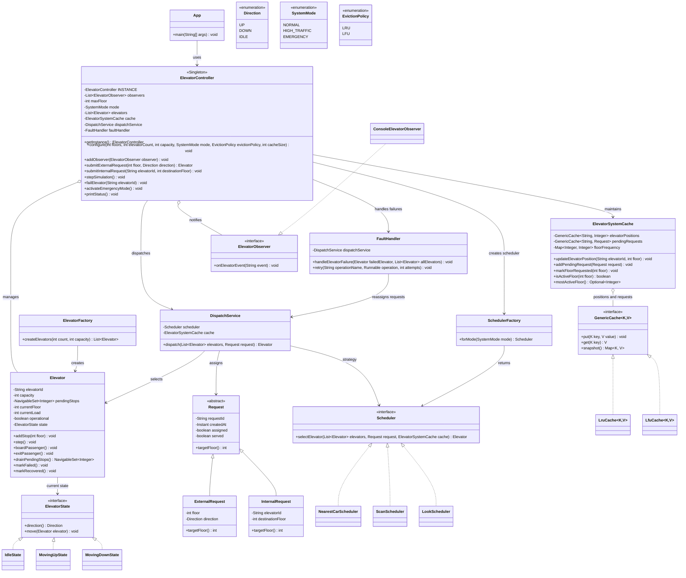

# Elevator System UML

```mermaid
classDiagram
    class App {
        +main(String[] args) void
    }

    class ElevatorController {
        <<Singleton>>
        -ElevatorController INSTANCE
        -List~ElevatorObserver~ observers
        -int maxFloor
        -SystemMode mode
        -List~Elevator~ elevators
        -ElevatorSystemCache cache
        -DispatchService dispatchService
        -FaultHandler faultHandler
        +getInstance() ElevatorController
        +configure(int floors, int elevatorCount, int capacity, SystemMode mode, EvictionPolicy evictionPolicy, int cacheSize) void
        +addObserver(ElevatorObserver observer) void
        +submitExternalRequest(int floor, Direction direction) Elevator
        +submitInternalRequest(String elevatorId, int destinationFloor) void
        +stepSimulation() void
        +failElevator(String elevatorId) void
        +activateEmergencyMode() void
        +printStatus() void
    }

    class Elevator {
        -String elevatorId
        -int capacity
        -NavigableSet~Integer~ pendingStops
        -int currentFloor
        -int currentLoad
        -boolean operational
        -ElevatorState state
        +addStop(int floor) void
        +step() void
        +boardPassenger() void
        +exitPassenger() void
        +drainPendingStops() NavigableSet~Integer~
        +markFailed() void
        +markRecovered() void
    }

    class ElevatorState {
        <<interface>>
        +direction() Direction
        +move(Elevator elevator) void
    }

    class IdleState
    class MovingUpState
    class MovingDownState

    class Request {
        <<abstract>>
        -String requestId
        -Instant createdAt
        -boolean assigned
        -boolean served
        +targetFloor() int
    }

    class ExternalRequest {
        -int floor
        -Direction direction
        +targetFloor() int
    }

    class InternalRequest {
        -String elevatorId
        -int destinationFloor
        +targetFloor() int
    }

    class DispatchService {
        -Scheduler scheduler
        -ElevatorSystemCache cache
        +dispatch(List~Elevator~ elevators, Request request) Elevator
    }

    class Scheduler {
        <<interface>>
        +selectElevator(List~Elevator~ elevators, Request request, ElevatorSystemCache cache) Elevator
    }

    class NearestCarScheduler
    class ScanScheduler
    class LookScheduler

    class SchedulerFactory {
        +forMode(SystemMode mode) Scheduler
    }

    class ElevatorFactory {
        +createElevators(int count, int capacity) List~Elevator~
    }

    class ElevatorSystemCache {
        -GenericCache~String, Integer~ elevatorPositions
        -GenericCache~String, Request~ pendingRequests
        -Map~Integer, Integer~ floorFrequency
        +updateElevatorPosition(String elevatorId, int floor) void
        +addPendingRequest(Request request) void
        +markFloorRequested(int floor) void
        +isActiveFloor(int floor) boolean
        +mostActiveFloor() Optional~Integer~
    }

    class GenericCache~K,V~ {
        <<interface>>
        +put(K key, V value) void
        +get(K key) V
        +snapshot() Map~K, V~
    }

    class LruCache~K,V~
    class LfuCache~K,V~

    class FaultHandler {
        -DispatchService dispatchService
        +handleElevatorFailure(Elevator failedElevator, List~Elevator~ allElevators) void
        +retry(String operationName, Runnable operation, int attempts) void
    }

    class ElevatorObserver {
        <<interface>>
        +onElevatorEvent(String event) void
    }

    class ConsoleElevatorObserver

    class Direction {
        <<enumeration>>
        UP
        DOWN
        IDLE
    }

    class SystemMode {
        <<enumeration>>
        NORMAL
        HIGH_TRAFFIC
        EMERGENCY
    }

    class EvictionPolicy {
        <<enumeration>>
        LRU
        LFU
    }

    App --> ElevatorController : uses
    ElevatorController o-- Elevator : manages
    ElevatorController --> DispatchService : dispatches
    ElevatorController --> FaultHandler : handles failures
    ElevatorController --> ElevatorSystemCache : maintains
    ElevatorController o-- ElevatorObserver : notifies
    ElevatorController --> SchedulerFactory : creates scheduler

    ElevatorFactory --> Elevator : creates
    Elevator --> ElevatorState : current state
    ElevatorState <|.. IdleState
    ElevatorState <|.. MovingUpState
    ElevatorState <|.. MovingDownState

    Request <|-- ExternalRequest
    Request <|-- InternalRequest
    DispatchService --> Scheduler : strategy
    DispatchService --> Request : assigns
    DispatchService --> Elevator : selects

    Scheduler <|.. NearestCarScheduler
    Scheduler <|.. ScanScheduler
    Scheduler <|.. LookScheduler
    SchedulerFactory --> Scheduler : returns

    ElevatorSystemCache o-- GenericCache : positions and requests
    GenericCache <|.. LruCache
    GenericCache <|.. LfuCache

    FaultHandler --> DispatchService : reassigns requests
    ConsoleElevatorObserver ..|> ElevatorObserver
```

