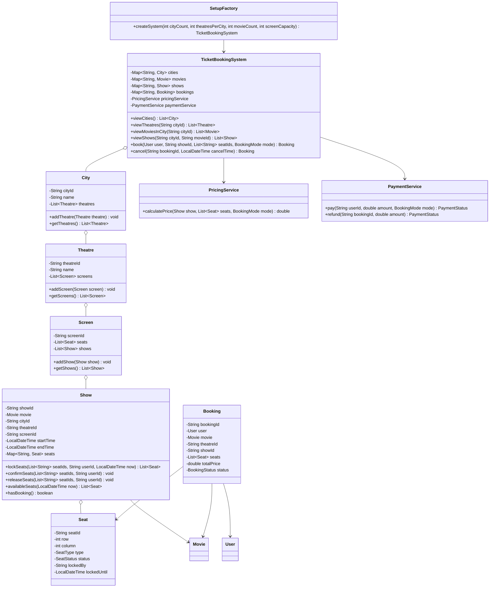

# Movie Ticket Booking System

## 1. Problem Statement
Design a movie ticket booking system that supports multiple cities, theatres, screens, shows, seat locking, payments, pricing, booking history, and cancellations.

The application takes input:
- `n`: number of cities
- `m`: number of theatres per city
- `k`: number of movies
- `screen_capacity`: number of seats per screen
- `booking_mode`: `normal` or `premium`

## 2. Main Features
- Multiple cities and theatres
- Multiple screens per theatre
- Multiple shows per screen per day
- No overlapping shows on the same screen
- Seat layout with regular and premium seats
- Seat states: `AVAILABLE`, `LOCKED`, `BOOKED`
- Temporary seat locking during booking
- Simulated payment with `SUCCESS`, `FAILED`, and `PENDING`
- Dynamic pricing based on seat type and show timing
- Booking history with user, movie, theatre, show, seats, price, and status
- Cancellation before show time with simulated refund
- Thread-safe seat locking to avoid double booking

## 3. Class Diagram
The standalone Mermaid UML diagram is available in `UML.md`.



## 4. Design Approach
`TicketBookingSystem` acts as the facade. It exposes the main user operations:
- browse cities
- browse theatres
- browse movies
- browse shows
- book seats
- cancel booking

`Show` owns seat state and performs seat locking with synchronized methods. This is the main concurrency control point and prevents two users from booking the same seat at the same time.

`PricingService` calculates dynamic price based on:
- regular vs premium seat
- morning, evening, or night show timing
- normal or premium booking mode

`PaymentService` simulates payment and refund.

`SetupFactory` creates sample cities, theatres, screens, movies, seats, and non-overlapping shows based on the input values.

## 5. Responsibility Breakdown
`App` handles user input and demonstrates the booking flow. It does not contain business logic.

`SetupFactory` builds the in-memory catalogue using the given inputs: number of cities, theatres per city, movies, and screen capacity.

`City`, `Theatre`, and `Screen` model the physical hierarchy of the booking system. A city contains theatres, a theatre contains screens, and a screen contains scheduled shows.

`Show` is the consistency boundary for seat state. It owns the seats for that show and uses synchronized methods for lock, confirm, release, and cancellation operations.

`Booking` stores the final booking history record with user, movie, show, theatre, seats, price, and status.

`PricingService` keeps pricing separate from booking flow, so pricing rules can change without modifying seat-locking logic.

`PaymentService` simulates payment and refund outcomes.

## 6. Seat Locking Flow
1. User selects one or more seats.
2. `Show.lockSeats(...)` expires old locks.
3. If every selected seat is available, all selected seats become `LOCKED`.
4. Payment is simulated.
5. If payment succeeds, locked seats become `BOOKED`.
6. If payment fails or remains pending, locked seats become `AVAILABLE` again.

## 7. Booking Flow
1. User views cities using `viewCities()`.
2. User selects a city and views theatres using `viewTheatres(cityId)`.
3. User views movies running in that city using `viewMoviesInCity(cityId)`.
4. User selects a movie and views shows using `viewShows(cityId, movieId)`.
5. User selects seats and calls `book(...)`.
6. System locks seats, calculates price, simulates payment, and confirms or releases seats.
7. User may cancel before show start using `cancel(...)`.

## 8. Consistency Rules
- A booked seat cannot be booked again.
- A locked seat cannot be booked by another user.
- Expired locks are released automatically before availability and booking checks.
- `Show` methods that mutate seats are synchronized for thread-safety.
- A screen rejects overlapping shows.
- A show runs only if it has at least one confirmed booking.

## 9. Pricing Explanation
Pricing is calculated dynamically using three factors:
- `SeatType.REGULAR` has a lower base price than `SeatType.PREMIUM`
- morning shows are cheaper, evening shows are costlier, and night shows use a separate multiplier
- `BookingMode.PREMIUM` adds a small premium booking multiplier

This keeps pricing extensible because new rules can be added inside `PricingService`.

## 10. Build And Run
```bash
cd ticket-booking-system/src
javac com/example/ticketbooking/*.java
java com.example.ticketbooking.App
```

## 11. Sample Input
```text
2
2
3
20
premium
```

## 12. Sample Output
```text
Created system with 2 cities, 2 theatres per city, and 3 movies.
Cities: [City-1, City-2]
Theatres in City-1: [Theatre-1-1, Theatre-1-2]
Movies in City-1: [Movie-1, Movie-2, Movie-3]
Available shows for Movie-1: 4
Selected seats: [A1, A2]
Booking confirmed: Booking{bookingId='B-1', user=User-1, movie=Movie-1, showId='SH-1-1-1-1', seats=[A1, A2], totalPrice=297.0, status=CONFIRMED}
Show runs: true
Cancelled booking: CANCELLED
```

## 13. Interview Summary
“I modeled the booking system with a facade for user operations, domain objects for cities, theatres, screens, shows and seats, synchronized show-level seat locking for consistency, a pricing service for dynamic pricing, and a payment service for payment/refund simulation.”
