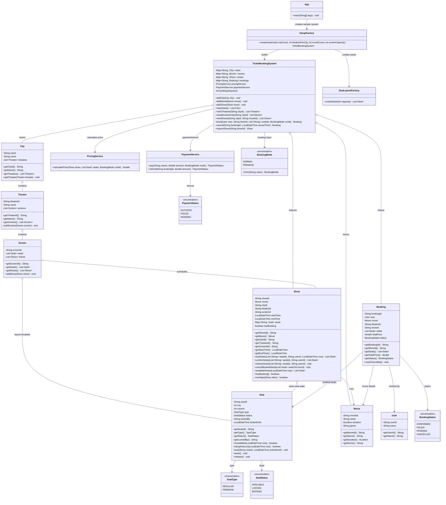

# Movie Ticket Booking System UML

```mermaid
classDiagram
    class App {
        +main(String[] args) void
    }

    class SetupFactory {
        +createSystem(int cityCount, int theatresPerCity, int movieCount, int screenCapacity) TicketBookingSystem
    }

    class TicketBookingSystem {
        -Map~String, City~ cities
        -Map~String, Movie~ movies
        -Map~String, Show~ shows
        -Map~String, Booking~ bookings
        -PricingService pricingService
        -PaymentService paymentService
        -int bookingSequence
        +addCity(City city) void
        +addMovie(Movie movie) void
        +addShow(Show show) void
        +viewCities() List~City~
        +viewTheatres(String cityId) List~Theatre~
        +viewMoviesInCity(String cityId) List~Movie~
        +viewShows(String cityId, String movieId) List~Show~
        +book(User user, String showId, List~String~ seatIds, BookingMode mode) Booking
        +cancel(String bookingId, LocalDateTime cancelTime) Booking
        +requireShow(String showId) Show
    }

    class City {
        -String cityId
        -String name
        -List~Theatre~ theatres
        +getCityId() String
        +getName() String
        +getTheatres() List~Theatre~
        +addTheatre(Theatre theatre) void
    }

    class Theatre {
        -String theatreId
        -String name
        -List~Screen~ screens
        +getTheatreId() String
        +getName() String
        +getScreens() List~Screen~
        +addScreen(Screen screen) void
    }

    class Screen {
        -String screenId
        -List~Seat~ seats
        -List~Show~ shows
        +getScreenId() String
        +getSeats() List~Seat~
        +getShows() List~Show~
        +addShow(Show show) void
    }

    class Show {
        -String showId
        -Movie movie
        -String cityId
        -String theatreId
        -String screenId
        -LocalDateTime startTime
        -LocalDateTime endTime
        -Map~String, Seat~ seats
        -boolean hasBooking
        +getShowId() String
        +getMovie() Movie
        +getCityId() String
        +getTheatreId() String
        +getScreenId() String
        +getStartTime() LocalDateTime
        +getEndTime() LocalDateTime
        +lockSeats(List~String~ seatIds, String userId, LocalDateTime now) List~Seat~
        +confirmSeats(List~String~ seatIds, String userId) List~Seat~
        +releaseSeats(List~String~ seatIds, String userId) void
        +cancelBookedSeats(List~Seat~ seatsToCancel) void
        +availableSeats(LocalDateTime now) List~Seat~
        +hasBooking() boolean
        +overlaps(Show other) boolean
    }

    class Seat {
        -String seatId
        -int row
        -int column
        -SeatType type
        -SeatStatus status
        -String lockedBy
        -LocalDateTime lockedUntil
        +getSeatId() String
        +getType() SeatType
        +getStatus() SeatStatus
        +getLockedBy() String
        +isAvailable(LocalDateTime now) boolean
        +isExpiredLock(LocalDateTime now) boolean
        +lock(String userId, LocalDateTime lockedUntil) void
        +book() void
        +release() void
    }

    class SeatLayoutFactory {
        +createSeats(int capacity) List~Seat~
    }

    class Movie {
        -String movieId
        -String name
        -Duration duration
        -String genre
        +getMovieId() String
        +getName() String
        +getDuration() Duration
        +getGenre() String
    }

    class User {
        -String userId
        -String name
        +getUserId() String
        +getName() String
    }

    class Booking {
        -String bookingId
        -User user
        -Movie movie
        -String theatreId
        -String showId
        -List~Seat~ seats
        -double totalPrice
        -BookingStatus status
        +getBookingId() String
        +getShowId() String
        +getSeats() List~Seat~
        +getTotalPrice() double
        +getStatus() BookingStatus
        +markCancelled() void
    }

    class PricingService {
        +calculatePrice(Show show, List~Seat~ seats, BookingMode mode) double
    }

    class PaymentService {
        +pay(String userId, double amount, BookingMode mode) PaymentStatus
        +refund(String bookingId, double amount) PaymentStatus
    }

    class BookingMode {
        <<enumeration>>
        NORMAL
        PREMIUM
        +from(String value) BookingMode
    }

    class SeatStatus {
        <<enumeration>>
        AVAILABLE
        LOCKED
        BOOKED
    }

    class SeatType {
        <<enumeration>>
        REGULAR
        PREMIUM
    }

    class PaymentStatus {
        <<enumeration>>
        SUCCESS
        FAILED
        PENDING
    }

    class BookingStatus {
        <<enumeration>>
        CONFIRMED
        FAILED
        PENDING
        CANCELLED
    }

    App --> SetupFactory : creates sample system
    SetupFactory --> TicketBookingSystem : builds
    SetupFactory --> SeatLayoutFactory : creates seats

    TicketBookingSystem o-- City : stores
    TicketBookingSystem o-- Movie : stores
    TicketBookingSystem o-- Show : indexes
    TicketBookingSystem o-- Booking : history
    TicketBookingSystem --> PricingService : calculates price
    TicketBookingSystem --> PaymentService : payment/refund

    City o-- Theatre : contains
    Theatre o-- Screen : contains
    Screen o-- Show : schedules
    Screen o-- Seat : layout template
    Show o-- Seat : owns seat state
    Show --> Movie : runs

    Booking --> User : booked by
    Booking --> Movie : movie details
    Booking --> Seat : booked seats
    Booking --> BookingStatus : status

    Seat --> SeatType : type
    Seat --> SeatStatus : state
    TicketBookingSystem --> BookingMode : booking input
    PaymentService --> PaymentStatus : returns
```

